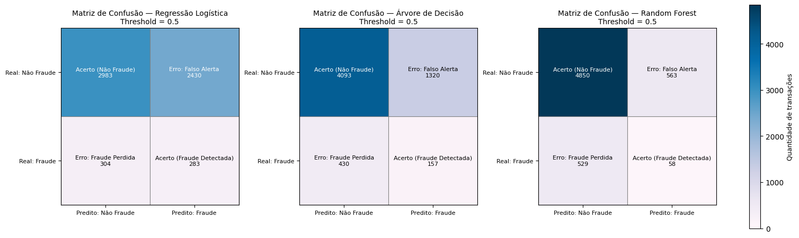

# 🚍 Detecção de Fraudes em Sistemas de Bilhetagem Eletrônica

## 📌 Contexto e Objetivo

Fraudes em sistemas de bilhetagem eletrônica representam um desafio recorrente para o transporte público, tanto pelo impacto financeiro quanto pelas consequências operacionais associadas a decisões automatizadas incorretas. Um dos principais riscos apontados pela área de negócio é o bloqueio indevido de cartões legítimos, que afeta diretamente a experiência dos usuários.

Este projeto tem como objetivo explorar dados históricos de bilhetagem e avaliar modelos de Machine Learning capazes de **identificar transações suspeitas**, priorizando interpretabilidade, controle operacional e clareza metodológica.

---

## 📂 Estrutura do Repositório

- **data/**
  - **raw/**
    - `dados.csv`
    - `Dicionário de Dados.pdf`
  - **processed/**
    - `dados_tratados.csv`
    - `schema_dados_tratados.json`
    - `metadados_colunas.csv`
    - `metadados_dataset.json`

- **notebooks/**
  - `01_exploracao_dados.ipynb`
  - `02_tratamento_features.ipynb`
  - `03_modelagem.ipynb`

- **outputs/**
  - `matrizes_confusao_modelos.png`
  - *(demais gráficos gerados durante a análise)*

- **src/**
  - `features.py`
  - `preprocessing.py`
  - `models.py`
  - `metrics.py`

- `README.md`
- `requirements.txt`

---

## 📘 Dicionário de Dados

O dataset original contém registros transacionais e cadastrais relacionados ao uso de cartões de transporte. Abaixo estão algumas das colunas mais relevantes, mantendo a descrição original fornecida.

| Coluna | Descrição | Tipo |
|------|-----------|------|
| id_transacao | Identificador único da transação. | Int |
| id_cartao | Identificador único do cartão (usuário). | Int |
| ts_transacao | Timestamp (data e hora) do uso na catraca. | Datetime |
| valor_transacao | Valor debitado no momento do giro da catraca. | Float |
| target_fraude | Variável Alvo: 1 para Fraude Confirmada, 0 para Normal. | Binary |

A descrição completa das variáveis está disponível em `data/raw/Dicionário de Dados.pdf`.

---

## 🔍 Análise Exploratória dos Dados

A análise exploratória teve como foco compreender a estrutura dos dados, o comportamento geral das transações e possíveis sinais associados à fraude. Foram avaliadas distribuições, padrões temporais, características do uso dos cartões e relações entre variáveis.

Essa etapa evidenciou a complexidade do problema e orientou as decisões posteriores de engenharia de features e modelagem.  
👉 **Os detalhes, gráficos e interpretações estão documentados no notebook `01_exploracao_dados.ipynb`, com comentários explicativos da autora.**

---

## 🧠 Engenharia de Features

A engenharia de features transformou a base transacional bruta em um dataset analítico, incorporando informações temporais, comportamentais e agregadas por cartão. O objetivo foi contextualizar cada transação dentro do histórico de uso do próprio cartão e do padrão operacional diário.

O dataset final possui **30.000 registros e 42 colunas**, sendo 38 features derivadas. A documentação completa dessas variáveis está disponível nos arquivos de metadados em `data/processed/`.

### Exemplos de Features Criadas

| Feature | Descrição |
|------|-----------|
| tempo_desde_ultima_transacao_min | Intervalo desde a última transação do cartão |
| qtd_linhas_distintas_dia | Linhas de ônibus distintas utilizadas no dia |
| cartao_media_transacoes_por_dia | Média histórica de transações diárias |
| valor_zscore_cartao | Desvio do valor em relação ao histórico do cartão |
| uso_acima_media_dia_cartao | Indica uso diário acima do padrão do cartão |

👉 **O processo completo de criação, validação e auditoria dessas features está no notebook `02_tratamento_features.ipynb`, com comentários explicativos da autora.**

---

## 🤖 Modelagem e Avaliação dos Modelos

Com os dados tratados, foram avaliados diferentes modelos de Machine Learning, considerando desempenho, interpretabilidade e impacto operacional.

### Modelos Considerados

| Modelo | Prós | Contras | Adequação |
|------|------|--------|----------|
| Regressão Logística | Alta interpretabilidade Coeficientes explicáveis | Relações lineares Depende de boas features | Muito alta |
| Árvore de Decisão | Regras claras Captura não linearidades | Sensível a ruído | Alta |
| Random Forest | Reduz overfitting Interações complexas | Menor transparência | Alta |
| Gradient Boosting | Forte poder preditivo | Complexidade elevada | Média |
| XGBoost / LightGBM | Alta performance | Uso operacional difícil | Média / Baixa |
| SVM | Bom em cenários específicos | Pouco interpretável | Baixa |
| kNN | Simples conceitualmente | Não escala bem | Baixa |
| Naive Bayes | Rápido | Suposições fortes | Baixa |

Foram avaliados na prática três modelos: **Regressão Logística**, **Árvore de Decisão** e **Random Forest**, utilizando validação cruzada estratificada, métricas adequadas a dados desbalanceados e avaliação em conjunto de teste independente.

👉 **Toda a construção dos pipelines, métricas, gráficos e análises está no notebook `03_modelagem.ipynb`, com comentários explicativos da autora.**

---

## 📊 Comparação Visual dos Modelos

A imagem abaixo apresenta as matrizes de confusão dos três modelos no conjunto de teste, permitindo comparar fraudes detectadas, fraudes perdidas e falsos alertas.

---

## 🧠 Conclusões

Os resultados indicaram desempenho limitado para todos os modelos avaliados, com métricas próximas ao comportamento aleatório. A análise visual e quantitativa mostrou forte sobreposição entre transações fraudulentas e legítimas, mesmo após a criação de features comportamentais e agregadas.

Nesse cenário, os modelos supervisionados se mostraram mais adequados como **ferramentas de priorização de risco**, apoiando a tomada de decisão, do que como mecanismos automáticos de bloqueio.

---

## 🚀 Recomendações e Próximos Passos

Para evoluir a solução em um ambiente real, algumas direções são promissoras:

- Enriquecimento dos dados com informações geográficas e sequenciais
- Modelagem explícita de sequências temporais por cartão
- Reformulação do problema como ranqueamento de risco
- Ajuste dinâmico de thresholds conforme perfil e contexto
- Integração do modelo a fluxos de revisão humana
- Uso de métodos não supervisionados para detecção de anomalias

---

## ✍️ Autoria

Projeto desenvolvido por **Letícia**, como estudo aplicado em Ciência de Dados e Aprendizado de Máquina, com foco em detecção de fraude, interpretabilidade e análise crítica de limitações em cenários reais.
